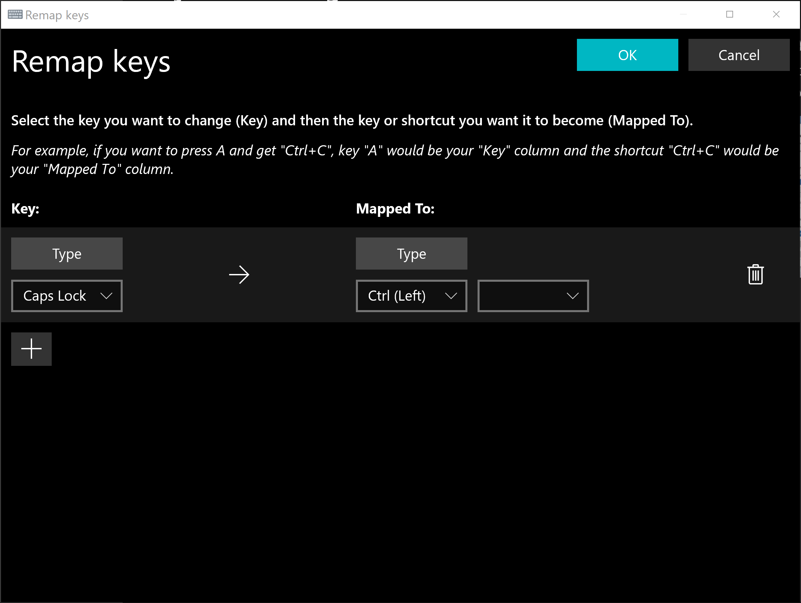

## Why switch caps lock for control 

  This is something that I have done on every machine I own for years. As a developer I spend a good portion of my day using the terminal. Being obsessed with efficency, I try to use my keyboard for everything as moving my hands to use a mouse/touchpad is not efficient. The use case for mapping caps lock to control is simple; I use control more often than caps lock _and_ I do not need my fingers to leave the home row to press the key that is next to "a". When I was using a mac this was useful mainly for jumping around the command line and there is some decent support for EMACS-style navigation in OSX (for example, CTRL+A to get to the beginning of a line could be used in web browsers).

  This is even more useful on Windows and Linux systems because you use the control key for many common things (copy, paste, undo, redo, etc...).

## How to make the swap

  There are two straight forward ways to do this

### PowerShell
  This is the easiest way. To start open Windows PowerShell (Admin) by pressing `Win + X`. Then enter these commands:

```

$hexified = "00,00,00,00,00,00,00,00,02,00,00,00,1d,00,3a,00,00,00,00,00".Split(',') | % { "0x$_"};

$kbLayout = 'HKLM:\System\CurrentControlSet\Control\Keyboard Layout';

New-ItemProperty -Path $kbLayout -Name "Scancode Map" -PropertyType Binary -Value ([byte[]]$hexified);

```

Save and reboot.

### PowerToys

PowerToys is a tool created by Microsoft that enables users to customize their Windows experience in a visual interface. It is open source and can be installed from <a href=https://github.com/microsoft/PowerToys/releases/ target=_blank>Here</a>

Once Installed go to the Keyboard Manager tabl and click Remap a Key. Select caps lock to control and you're good to go.



